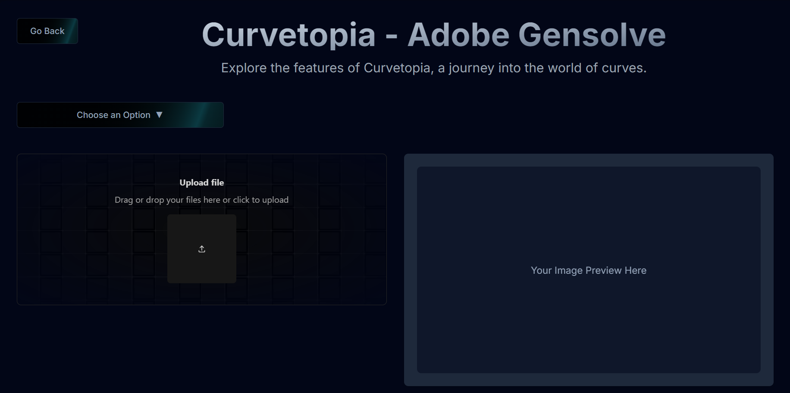

---

# 🌟 Curvetopia - Adobe Gensolve 🌟

## 📖 Table of Contents

- [Overview](#overview)
- [Key Features](#key-features)
- [Dependencies](#dependencies)
  - [Frontend](#frontend)
  - [Backend](#backend)
  - [Environment Variables](#environment-variables)
- [Installation](#installation)
  - [Frontend Installation](#frontend-installation)
  - [Backend Installation](#backend-installation)
- [Usage](#usage)
  - [Frontend](#frontend-1)
  - [Backend Endpoints](#backend-endpoints)
- [Development & Contribution](#development--contribution)
  - [Development Workflow](#development-workflow)
  - [Code Structure](#code-structure)
- [Screenshots & Visuals](#screenshots--visuals)
  - [Home Page](#home-page)
  - [Explore Page](#explore-page)
- [Acknowledgements](#acknowledgements)
- [Deployment](#deployment)
- [License](#license)

---

## Overview

**Curvetopia**, created for the Adobe Hackathon, transforms 2D line art into smooth, symmetrical curves using advanced algorithms and cubic Bézier techniques. It refines basic shapes like lines, circles, and polygons, enhancing symmetry and filling gaps to complete curves. With Python, Matplotlib, and SVG rendering, Curvetopia helps artists turn sketches into polished, professional-grade artwork.

## Key Features

- **Shape Detection and Regularization**: Automatically detects and regularizes shapes from CSV and PNG files.
- **Curve Completion**: Fills in incomplete shapes, turning sketches into complete forms.
- **Symmetry Detection**: Identifies and highlights lines of symmetry in shapes.

## Dependencies

### Frontend:
- **Framework**: Next.js

### Backend:
- **Core Technologies**: Flask, NumPy, OpenCV, Matplotlib
- **Libraries**:
  - Flask
  - Flask-CORS
  - OpenCV-Python
  - Matplotlib
  - Scikit-learn
  - Shapely
  - SciPy
  - SVGPathTools
  - Gunicorn

### Environment Variables:
- **Frontend**: Create a `.env` file with the following:
  
  `NEXT_PUBLIC_ML_URL=<URL_of_the_Backend>`

## Installation

### Frontend Installation:
1. Clone the repository:

   `git clone https://github.com/PavanaSakethaRam/Adobe-Gensolve`

2. Navigate to the frontend folder:

   `cd frontend`

3. Install dependencies:

   `npm install`

4. Start the development server:

   `npm run dev`

### Backend Installation:
1. Navigate to the backend folder:

   `cd backend`

2. Create and activate a virtual environment:

   `python -m venv venv`
   
   `source venv/bin/activate`
    
   On Windows use:
    
   `\venv\Scripts\activate\`

3. Install the required packages:

   `pip install -r requirements.txt`

4. Start the Flask server:

   `python app.py`

## Usage

### Frontend:
- **Home Page**: The landing page that introduces Curvetopia.
- **Explore Page**: Where users can upload images or CSV files to see the regularization and symmetry detection in action.

### Backend Endpoints:
- **/regularization_csv**: Regularization for CSV files.
- **/regularization_png**: Regularization for PNG images.
- **/detect_symmetry_png**: Detect symmetry lines in PNG images.

## Development & Contribution

### Development Workflow:
1. Fork the repository.
2. Create a new branch:

   `git checkout -b feature-branch`

3. Make your changes and commit them.
4. Push your branch and create a pull request.

### Code Structure:
The project is structured to ensure optimal performance and scalability, with a clear separation of frontend and backend functionalities.

## Screenshots & Visuals

Here are some visuals demonstrating the project’s capabilities:

### Home Page

### Explore Page

## Acknowledgements

My Team:
- [**Sridhar Suthapalli**](https://github.com/illuminati9/) 🌟
- [**Gnanendra Raghava**](https://github.com/raghavakamuju/) 🌟
- [**Pavana Saketha Ram**](https://github.com/PavanaSakethaRam) 🌟
  

## Deployment

The project is deployed at [Curvetopia](https://adobe-gensolve-95ye.onrender.com). Since it’s deployed on Render, it may take some time to activate. Please be patient.

## License

This project is licensed under the MIT License.

---

🎨 **Thank you for exploring Curvetopia! Feel free to contribute or reach out with any questions.** 🎨

---
